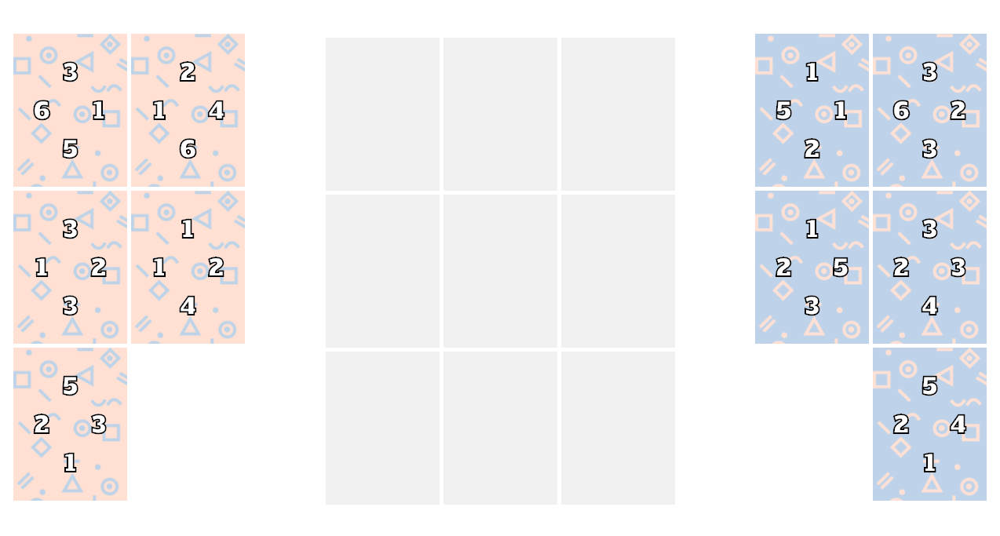

## Triple Triad Game

Triad is a card game inspired from a Final Fantasy VIII subgame called Triple Triad. In the game two players face off against one another, one side playing as "first player" or "pale pink", the other one as "second player" or "pale blue" on a 3x3 grid. Each player has five cards in its deck, and the aim is to capture the opponent's cards by turning them into the current player's own color. The player that ends having more cards of his color placed at the board, is the one who wins.

Get into https://anaamilo.github.io/triple-triad-game/ and check it out!
